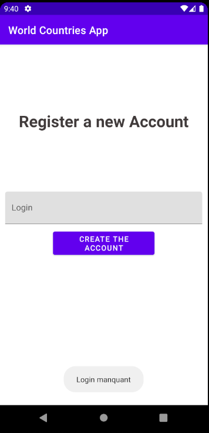

World Countries App

### Par Sofiane SERKESTI


## Présentation

Projet d'application mobile codée en Kotlin.
Elle affiche la liste des pays du monde, ainsi que leurs capitales à partir de l'API :
````
https://restcountries.eu/
````

## Consignes respectés :

- Code en Kotlin 
- Architecture MVVM
- Clean Architecture
- Utilisation d’une réelle BDD
- Utilisation Api REST
- Affichage d’une RecyclerView
- Design
- Fonctionnalités supplémentaire :
	- Page de Login et Register
	- Image application


## Fonctionnalités :
### Ecran de Login
- Case pour mettre son Login
- Bouton de Connexion
- Bouton de Création de Compte

    

### Ecran de Register
- Case pour mettre son Login
- Bouton pour enregistrer le compte dans la Base de donnée

    

### Ecran de Liste 
- Affiche la liste des pays :
	- Nom du Pays
	- Sa capitale
	- Son drapeau (problème d'implémentation suite au format de données dans l'API)

  

## Etapes de Développement :
### 1.Choix de l'API
Après avoir voulu utiliser l'API de la série "Rick & Morty", j'ai finalement décidé d'en utiliser une
sur les Pays du monde.

### 2.Choix de la Fonctionnalité
Implémentation d'une fonctionnalité de login, mais comme il s'agit d'une application personnelle,
il n'y a pas de mot de passe nécessaire.

### 3.Architecture 
Ajout de la structure MVVM et de la clean architecture, qui permettent de structurer le code.

### 4.Requete API
Utilisation de Retrofit et création de l'Adapter pour que l'application fonctionne avec la recyclerview

### 5.Ajout RecyclerView et Layout
Ajout de la RecyclerView et des Layout des views afin d'afficher les données récupérés grâce à l'API


